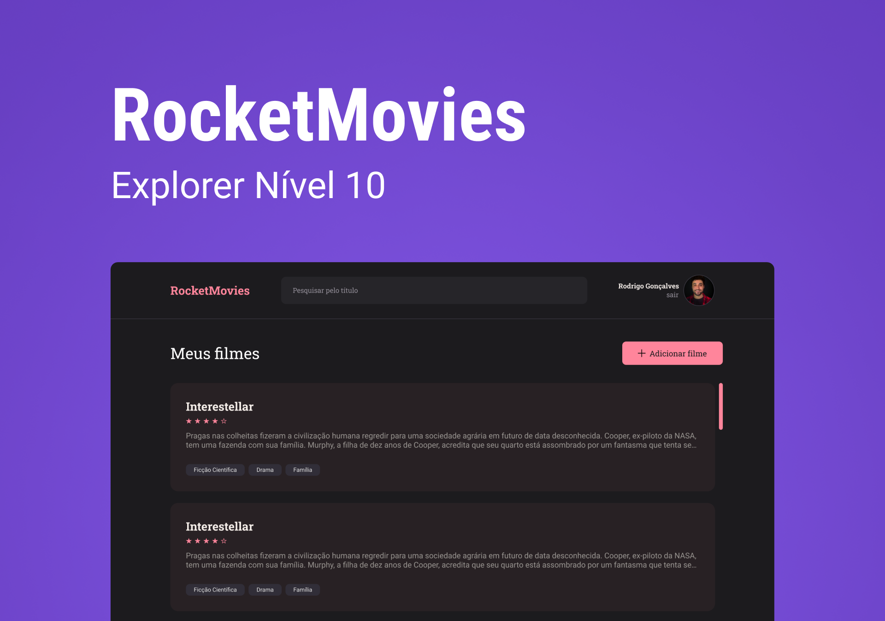

<h1 align="center"> Stage09  RocketMovies</h1>

  <a href="#-tecnologias">Tecnologias</a>&nbsp;&nbsp;&nbsp;|&nbsp;&nbsp;&nbsp;
  <a href="#-projeto">Projeto</a>&nbsp;&nbsp;&nbsp;|&nbsp;&nbsp;&nbsp;
  <a href="#-layout">Layout</a>&nbsp;&nbsp;&nbsp;|&nbsp;&nbsp;&nbsp;
  <a href="#memo-licença">Licença</a>

  

 
  

  

## 🚀 Tecnologias

Esse projeto foi desenvolvido com as seguintes tecnologias:

- HTML 
- CSS
- Git e Github
- Figma
- Javascript
- React

## 💻 Projeto

 Esse projeto é uma introdução ao React, onde aprendemos sobre CSS in JavaScript, Maps, Style Global, Theme, ArrowFunction, Components e Rotas em React. Projeto feito e desenvolvido nas aulas pratica da RocketSeat Explorer STAGE 09.

<h2> Conceitos aprendidos em aula</h2>

  <ul>
  <li>CSS in JavaScript</li>
  <li>Maps</li>
  <li>Style Global</li>
  <li>Theme</li>
  <li>Arrow Function</li>
  <li>Components e Rotas</li>

  </ul>
      
 

- [Visite o projeto online](https://MarcioEdu.github.io/Rocketmovies)

 

## 🔖 Layout

Você pode visualizar o layout do projeto através [DESSE LINK](https://www.figma.com/file/oWhcMpEUs6BWvMUQJHEJna/RocketNotes-Copy?fuid=1152971615023379029). É necessário ter conta no [Figma](https://figma.com) para acessá-lo. 

  

## :memo: Licença

Esse projeto está sob a licença MIT.

---

Feito por Marcio Eduardo :wave: [Participe da comunidade da RocketSeat!](https://discord.gg/rocketseat)